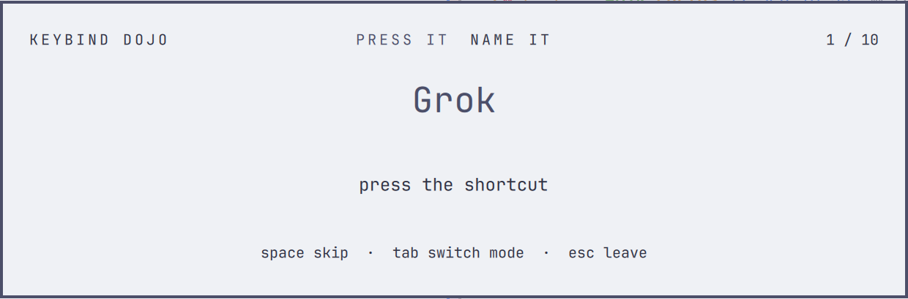

# Keybind Dojo

Learn **your own** Hyprland keybindings. A fullscreen quiz built from the binds you actually have
(`hyprctl binds -j`), that remembers which ones you keep missing and asks those more often.



## Two ways to train

- **Press it** — you see what a binding does ("Close window") and press the chord. The modifiers you hold light
  up as keycaps. Miss, and the dojo tells you what the chord you pressed *really* does, shows the right one, and
  waits for you to press it once correctly — the point is for your hands to learn it.
- **Name it** — you see the chord and pick what it does from four options (`1`–`4`). Decoys share the same
  modifiers, because those are the ones people actually mix up.

Rounds are 10 questions. The summary shows your score, a belt rank (white → black, by how many bindings you have
solid), and the bindings worth another look.

## How pressing SUPER+W doesn't close your window

While the dojo is open it switches Hyprland into an empty **submap**, so global keybindings are suspended and the
chords reach the quiz instead. Getting your binds back is guarded four ways:

1. closing the dojo (`esc`, clicking outside) leaves the submap;
2. `SUPER + ESCAPE` is bound inside the submap as a hard exit;
3. a watchdog (`bin/dojo-submap watch`) restores the binds the moment the dojo stops answering — shell crash,
   plugin reload, or a locked session;
4. 90 seconds without a key press and the dojo closes itself.

Requires Hyprland's Lua config API (`hl.define_submap`), as shipped with Omarchy 4.

## Install

```bash
omarchy plugin add https://github.com/cgranier/omarchy-keybind-dojo.git --enable
```

Open it with `omarchy-shell shell toggle cgranier.dojo '{}'` (add `'{"mode":"name"}'` to start in Name it).
To put it in the Omarchy menu under Learn, add to `~/.config/omarchy/extensions/omarchy-menu.jsonc`:

```jsonc
"learn.dojo": {"icon":"󰌌","label":"Keybind Dojo","action":"omarchy-shell shell toggle cgranier.dojo '{}'","aliases":["dojo"]},
```

## Uninstall

```bash
omarchy plugin remove cgranier.dojo
rm -rf ~/.local/state/omarchy-dojo        # optional: your quiz progress
```

If you added the `learn.dojo` row to `~/.config/omarchy/extensions/omarchy-menu.jsonc`, delete that line too. The plugin
changes nothing else: the Hyprland submap it uses exists only at runtime and is gone after a Hyprland reload.

## Keys

| Key | Action |
|---|---|
| any chord | answer (Press it) |
| `1`–`4` | answer (Name it) |
| `space` / `enter` | skip · next · another round |
| `tab` | switch mode (restarts the round) |
| `esc` | leave |

## What gets asked

Bindings with a description, at least one modifier, and a key the dojo can both show and detect: letters, digits,
F-keys, arrows, and common named keys. Media keys, mouse binds, and lid switches are skipped, and so is anything on
`ESCAPE`.

Hyprland's Lua config provider currently reports `code:N` binds with an empty key. For the numbered families
("Switch to workspace 3") the dojo infers the digit from the description; other key-less binds are skipped.

Progress lives in `~/.local/state/omarchy-dojo/stats.json`. Delete it to start over.

## Development

```
manifest.json     overlay plugin declaration
Dojo.qml          overlay surface, round flow, key handling
Model.js          pure logic: cards from binds, chord matching, card picking, stats
bin/dojo-submap   enter / leave / watch the Hyprland submap
tests/            node tests + synthetic bind fixture
```

```bash
node tests/model.test.js
omarchy plugin validate .
omarchy-shell cgranier.dojo state     # phase, current card, score (while open)
```

QML hot-reloads on save; `Model.js` and new IPC functions need `omarchy restart shell`. Don't take screenshots of it
while the session is locked — screen capture blocks under a session lock.

## License

MIT
